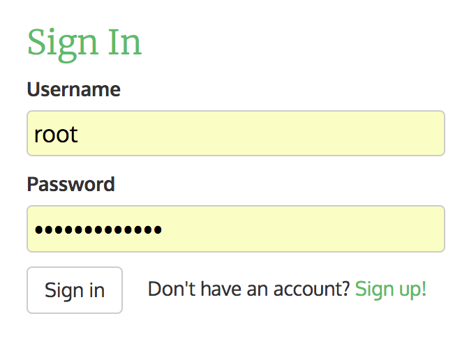
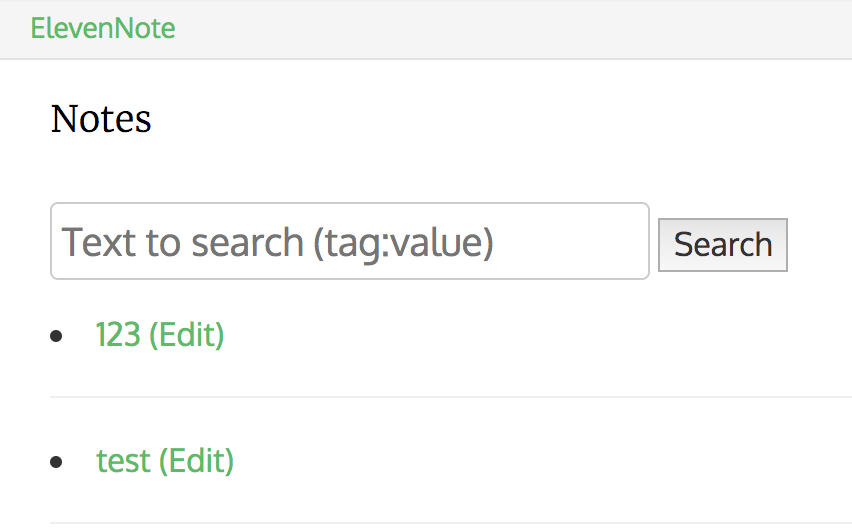
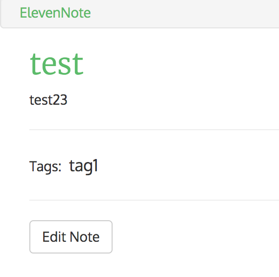
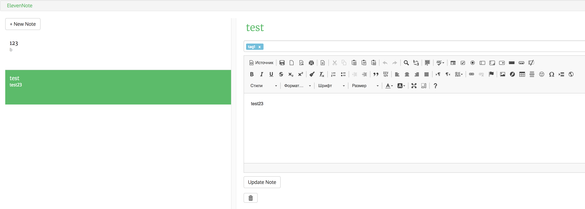
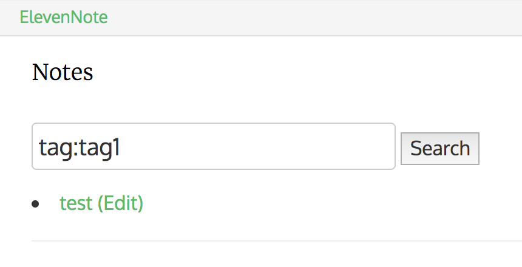
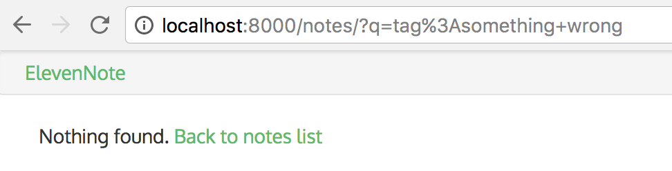
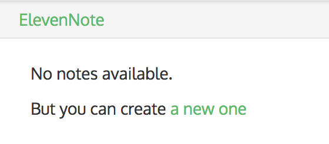

- Sign In form

- Notes List + Search Form (search by content of title and body, search by specific tag)

- Notes Detail page (title, body, tags)

- Note Edit page (using `ckeditor`, <a href="https://bootstrap-tagsinput.github.io/bootstrap-tagsinput/examples/" target="_blank">bootstrap-tags-input</a>, currently editing note background is highlighted on the left panel)

- Search By Tag results (tag 'tag1' is used)

- Search By Tag - notes with tag used does not exist

- No Notes Available page

---

Features:
- [x] Add tags to notes
- [x] Use ajax to update content
- [x] Add search by title & body and by tag using format "tag:search_value"
- [ ] Add notes sharing
- [ ] Add notes grouping
- [ ] Add API, describe using `swagger`
